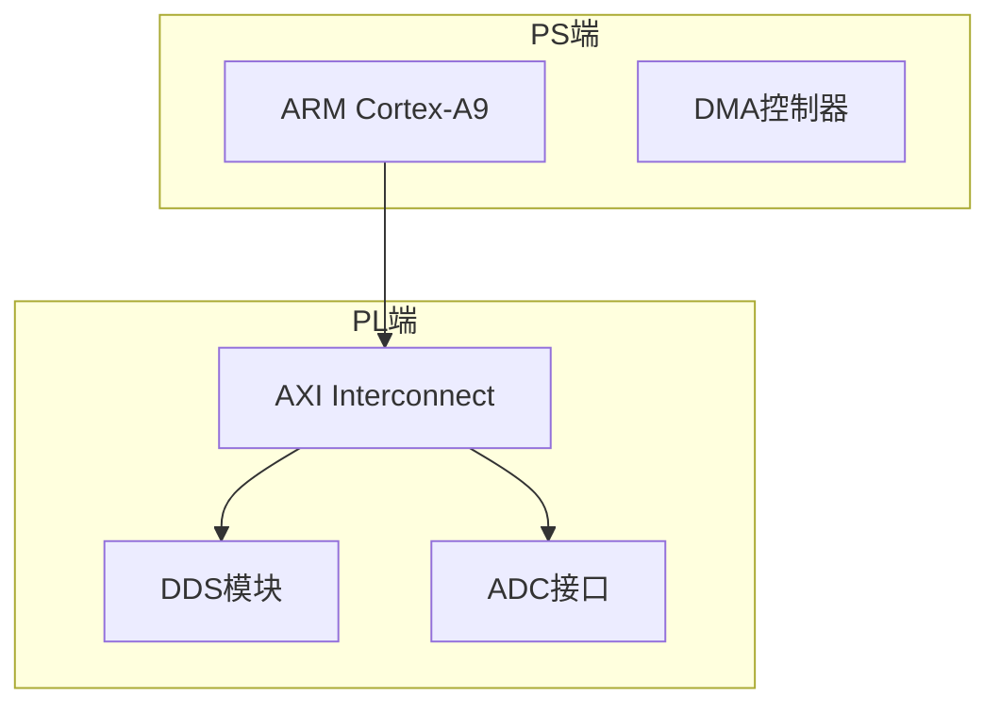

# 规则操作手册（详细参考）

> **说明**：本文件存放从 .trae/rules/ 各规则文件中提取的操作性内容。规则文件只保留原则和判定标准，详细操作参考本文件。
> **维护责任**：@V 工程规则管理师
> **更新日期**：2026-05-20

---

## 一、P0_07 架构文档标准模板

### 1.1 系统架构图模板（Mermaid）



### 1.2 模块接口定义模板

| 信号名 | 方向 | 位宽 | 说明 |
|--------|------|------|------|
| clk | input | 1 | 时钟 |
| rst_n | input | 1 | 异步复位，低有效 |

### 1.3 引脚规划模板

| 信号名 | 引脚 | I/O标准 | 驱动 | 备注 |
|--------|------|---------|------|------|
| sys_clk_50m | U18 | LVCMOS33 | - | MRCC |

### 1.4 时序预算模板

| 时钟名 | 频率 | 周期 | 来源 |
|--------|------|------|------|
| sys_clk | 100MHz | 10ns | 板载晶振 |

目标：WNS > 1ns, TNS = 0

### 1.5 AXI寄存器映射模板

| 地址偏移 | 名称 | 类型 | 位宽 | 说明 |
|----------|------|------|------|------|
| 0x00 | CTRL | R/W | 32 | 全局控制 |

---

## 二、P0_08 小步快跑操作细节

### 2.1 验证标准

**硬件**：语法无ERROR → 综合通过 → WNS>0, TNS=0 → 资源合理 → @V合规
**软件**：语法无ERROR → 单元测试通过 → 集成测试通过 → @V合规
**文档**：完整性 → 准确性 → 一致性 → @V合规

### 2.2 代码行数统计

```bash
git diff --stat
git diff | grep -E "^\+[^+]" | wc -l
```

### 2.3 任务拆分示例

DDS模块（200行）拆分：端口定义(20行) → 相位累加器(40行) → LUT(30行) → 输出寄存器(20行) → 控制逻辑(30行) → 测试平台(40行) → 约束(20行)

### 2.4 步骤记录模板

```markdown
### Step N: [步骤名]
- 目标：[描述]
- 代码行数：N行
- 验证：[结果] ✅
- @V签字：✅
```

---

## 三、P1_02 三层回滚操作命令

### 3.1 L1 Feature Flags

```python
FEATURE_MODULE_V2 = False  # 默认关闭
if FEATURE_MODULE_V2:
    from module_v2 import Module
```

### 3.2 L2 git revert

```bash
git log --oneline -5
git show HEAD
git revert HEAD
git push origin main
```

### 3.3 L3 Worktree

```bash
git worktree add ../hotfix main
cd ../hotfix
# 修复...
git add . && git commit -m "fix: ..."
cd ../main_project && git merge --ff-only main
git worktree remove ../hotfix
```

### 3.4 回滚记录模板

```markdown
【回滚记录】
- 时间：YYYY-MM-DD HH:MM
- 层级：L1/L2/L3
- 原因：[描述]
- 执行人：@X
- 影响范围：[模块/功能]
- 后续处理：[描述]
```

---

## 四、P1_03 前期规划时间分配

| 阶段 | 占比 | 周数 |
|------|------|------|
| 战略定型 | 20-25% | 2-3周 |
| 工程定型 | 25-30% | 3-4周 |
| 工程落地 | 45-55% | 6-9周 |

规划不足后果：需求不充分→30-50%返工；方案不完整→20-30%返工；接口不清晰→15-25%返工

---

## 五、P2_01 文档提炼操作模板

### 5.1 分发指令模板

```markdown
@专业智能体
【预处理完成文档】原始文件：XXX.[格式]
预处理文件：XXX_preprocessed.md
文档类型：[类型]
请基于该规整初稿进行深度专业提炼：
1. 结合NV色心实验项目，提炼核心技术要点
2. 总结实操方法
3. 明确参数标准
4. 梳理避坑经验
5. 形成落地思路
输出：Markdown干货文档，存入 01_knowledge_base/[对应目录]/
```

### 5.2 处理简报模板

```markdown
【文档处理简报】
原始文件：XXX.[格式] | 大小：X MB
预处理：XXX_preprocessed.md ✅
深度提炼：XXX_refined.md ✅ | 核心要点X条 | 实操方法X项
审核：@V | 结果：通过/不通过
存储：01_knowledge_base/[目录]/
知识库状态：待手动投喂
```

### 5.3 重大任务判定

需老板终审：≥10篇文档、新建知识库、架构设计、核心代码、规则修订
无需终审：单文档、日常调试

---

## 六、P2_02 小步快跑补充操作

### 6.1 大任务拆分示例（ODMR实验流程）

| 子任务 | 时间 | 改动边界 |
|--------|------|----------|
| 微波源驱动 | 2天 | 仅微波源模块 |
| 数据采集 | 2天 | 仅采集模块 |
| 流程控制 | 2天 | 仅流程控制 |
| 数据处理 | 2天 | 仅数据处理 |
| Jupyter界面 | 2天 | 仅界面模块 |
| 集成测试 | 2天 | 集成验证 |

### 6.2 Bug修复后同类检查

修复Bug后→分析Bug类型→全局搜索同类→发现则一并修复→未发现则确认完成

检查范围：位宽不匹配(全模块)、out端口读取(全模块)、信号未连接(全顶层)、时序违例(相关模块)

---

## 七、P2_04 文档保存操作细节

### 7.1 规范目录结构

```
项目根目录/
├── 01_knowledge_base/     @D 文档预处理工程师
├── 03_code/               @P 架构师管理
│   ├── 01_vhdl_modules/   @H 硬件工程师
│   ├── 02_python_drivers/ @S 软件工程师
│   └── 03_jupyter_notebooks/ @S 软件工程师
├── 04_docs/               @P 架构师管理
│   ├── 01_specs/          @P 架构师
│   ├── 02_reports/        各智能体
│   └── 03_manuals/        @E 文档工程师
├── .trae/rules/              @V 工程规则管理师
└── 06_experiment_data/    @Q 量子科学家
```

### 7.2 Git提交规范

```bash
git add .
git commit -m "[@X] 描述"
git push
```

### 7.3 保存确认报告格式

```markdown
### 【@V】保存确认报告
| 序号 | 文件名 | 保存路径 | 状态 |
|:----:|--------|----------|:----:|
| 1 | xxx.vhd | 03_code/01_vhdl_modules/xxx.vhd | ✅ |
```

---

## 八、P2_05 合规检查输出模板

### 8.1 轻量检查

```markdown
【@V】任务合规检查（轻量）| 时间：YYYY-MM-DD HH:MM
✅ 通过 | 检查项：P0规则 + 角色职责（5项）
```

### 8.2 常规检查

```markdown
【@V】任务合规检查（常规）| 时间：YYYY-MM-DD HH:MM
⚠️ 有条件通过
【不合规项】序号 | 维度 | 问题 | 建议
【整改要求】具体整改内容
```

### 8.3 深度检查

```markdown
【@V】任务合规检查（深度）| 时间：YYYY-MM-DD HH:MM
❌ 不通过
【检查汇总】P0(5/5) P1(3/4) 灵魂(4/4) 职责(4/4) 标准(3/4)
【不合规详情】序号 | 维度 | 规则 | 问题 | 严重度 | 建议
【整改要求】1... 2... 3...
【风险提醒】...
```

### 8.4 Vivado完整性检查命令

```tcl
report_property -all [get_ports]
report_drc
```

---

## 九、P2_06 波特图操作模板

### 9.1 节点定义表

| 节点ID | 任务名称 | 负责人 | 交付物 | 前置条件 | 状态 |
|:------:|----------|--------|--------|----------|:----:|

### 9.2 进度报告模板

```markdown
## 项目进度报告
整体状态：总X个 | 已完成X | 进行中X | 待启动X | 阻塞X
今日完成：节点ID | 任务 | 负责人 | 验收结果
就绪任务：节点ID | 任务 | 负责人 | 前置已满足
阻塞任务：节点ID | 任务 | 原因 | 方案
风险预警：...
需老板决策：...
```

---

## 十、P3_02 外部查询操作示例

```
❌ 现有知识库无相关内容
💡 建议查询：正点原子开源电子网 http://www.openedv.com/
📍 对应板块：【正点原子FPGA专区】
🔍 推荐关键词：关键词1、关键词2、关键词3
```

板块URL：
- FPGA专区：http://www.openedv.com/forum-50-1.html
- Linux专区：http://www.openedv.com/forum-52-1.html

---

## 十一、P3_03 标注操作示例

正确：`【@H 硬件工程师】VHDL代码实现`
错误：`我来编写代码...`（未标注）、`【@H】代码如下...`（缺全名）

标注场景：代码编写、脚本生成、设计文档、参数计算、代码审核、任务分配
可选标注：简单对话、确认回答、信息查询
