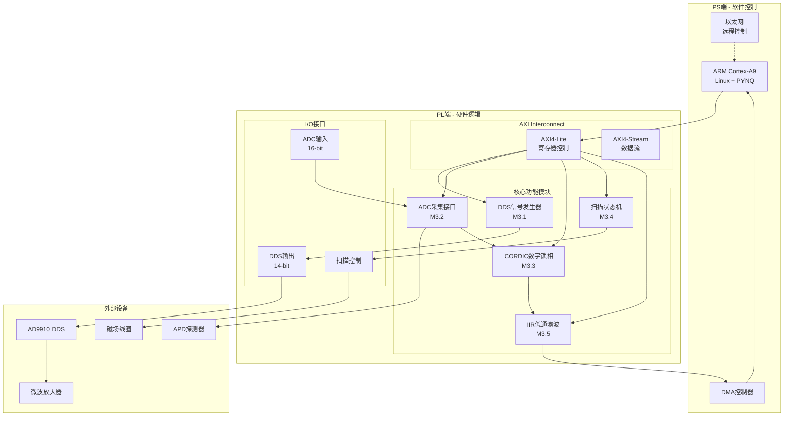
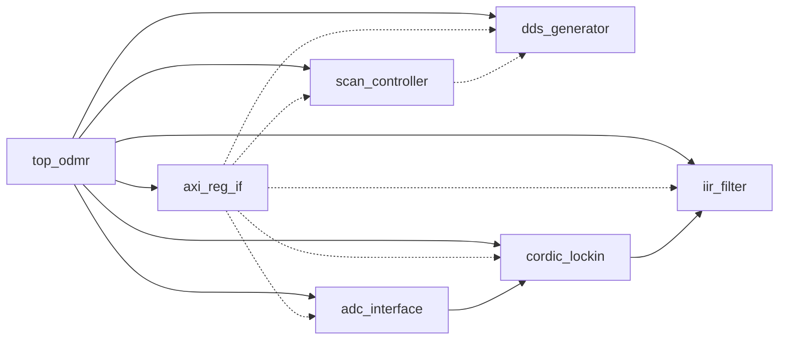
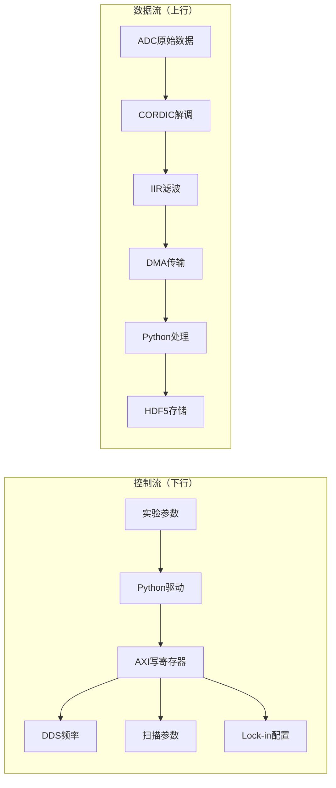
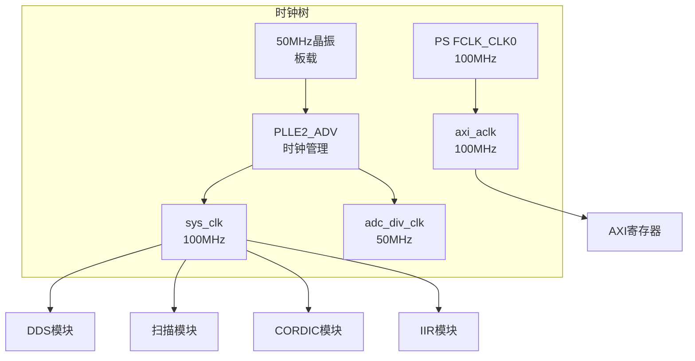
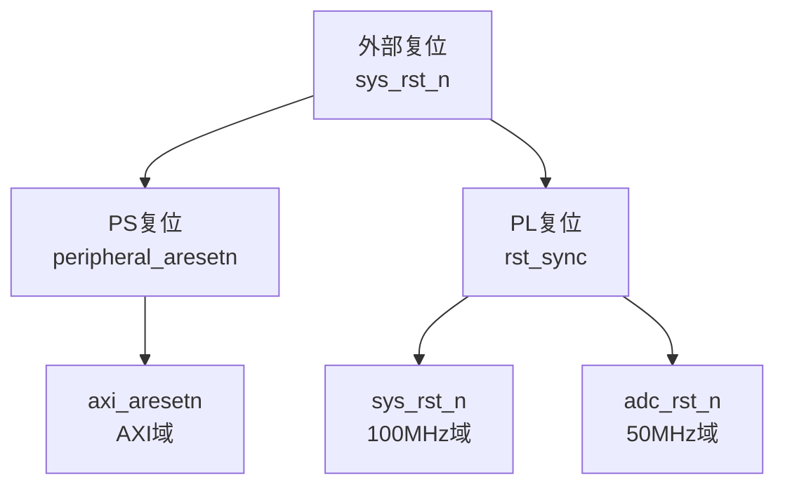

# NV色心实验系统 - 系统架构设计

> **文档版本**：V1.0  
> **日期**：2026-05-19  
> **作者**：@A 架构师  
> **评审人**：@V @P

---

## 一、系统概述

### 1.1 设计目标

构建一个基于ZYNQ7020的NV色心ODMR实验控制系统，实现：
- 微波脉冲精确控制（10ns分辨率）
- 光子计数与Lock-in解调
- 频率扫描与数据采集
- 实时反馈控制

### 1.2 设计原则

| 原则 | 说明 |
|------|------|
| 模块化 | 各功能模块独立，接口标准化 |
| 实时性 | PL端硬实时，PS端软实时 |
| 可扩展 | 预留接口，支持功能扩展 |
| 可靠性 | 跨时钟域处理，异常保护 |

---

## 二、系统架构图



---

## 三、模块划分

### 3.1 模块清单

| 模块名 | 功能 | 负责人 | 状态 |
|--------|------|--------|:----:|
| top_odmr | 顶层模块，集成所有子模块 | @H | M3.0 |
| dds_generator | DDS信号发生器控制 | @H | M3.1 |
| adc_interface | ADC数据采集接口 | @H | M3.2 |
| cordic_lockin | CORDIC数字锁相放大 | @H | M3.3 |
| scan_controller | 频率扫描状态机 | @H | M3.4 |
| iir_filter | IIR低通滤波器 | @H | M3.5 |
| axi_reg_if | AXI寄存器接口 | @S @H | M3.0 |

### 3.2 模块关系图



---

## 四、数据流设计

### 4.1 控制流（PS→PL）

```
用户 → Jupyter Notebook → Python驱动 → AXI寄存器 → 各功能模块
```

### 4.2 数据流（PL→PS）

```
ADC → CORDIC → IIR → DMA → DDR → Python → Jupyter → 用户
```

### 4.3 数据流图



---

## 五、时钟架构

### 5.1 时钟树



### 5.2 时钟域划分

| 时钟域 | 频率 | 用途 | 模块 |
|--------|------|------|------|
| sys_clk | 100MHz | 主系统时钟 | DDS, SCAN, CORDIC, IIR |
| axi_clk | 100MHz | AXI接口时钟 | AXI寄存器 |
| adc_clk | 50MHz | ADC采样时钟 | ADC接口 |

### 5.3 跨时钟域处理

| 跨时钟域路径 | 处理方法 | 说明 |
|--------------|----------|------|
| sys_clk → adc_clk | 异步FIFO | ADC数据缓冲 |
| adc_clk → sys_clk | 握手同步 | 控制信号同步 |
| axi_clk → sys_clk | 双触发器 | 寄存器控制 |

---

## 六、复位策略

### 6.1 复位树



### 6.2 复位策略表

| 复位域 | 复位源 | 同步方式 | 释放顺序 |
|--------|--------|----------|----------|
| 全局复位 | 外部按键 | 异步复位同步释放 | 第1 |
| PS复位 | PS端输出 | 异步复位同步释放 | 第2 |
| PL系统复位 | 全局复位同步 | 同步复位 | 第3 |
| AXI复位 | PS复位 | 同步复位 | 第4 |

---

## 七、版本历史

| 版本 | 日期 | 变更内容 | 作者 |
|------|------|----------|------|
| V1.0 | 2026-05-19 | 初始版本 | @A |

---

**下一步：模块接口定义文档**
