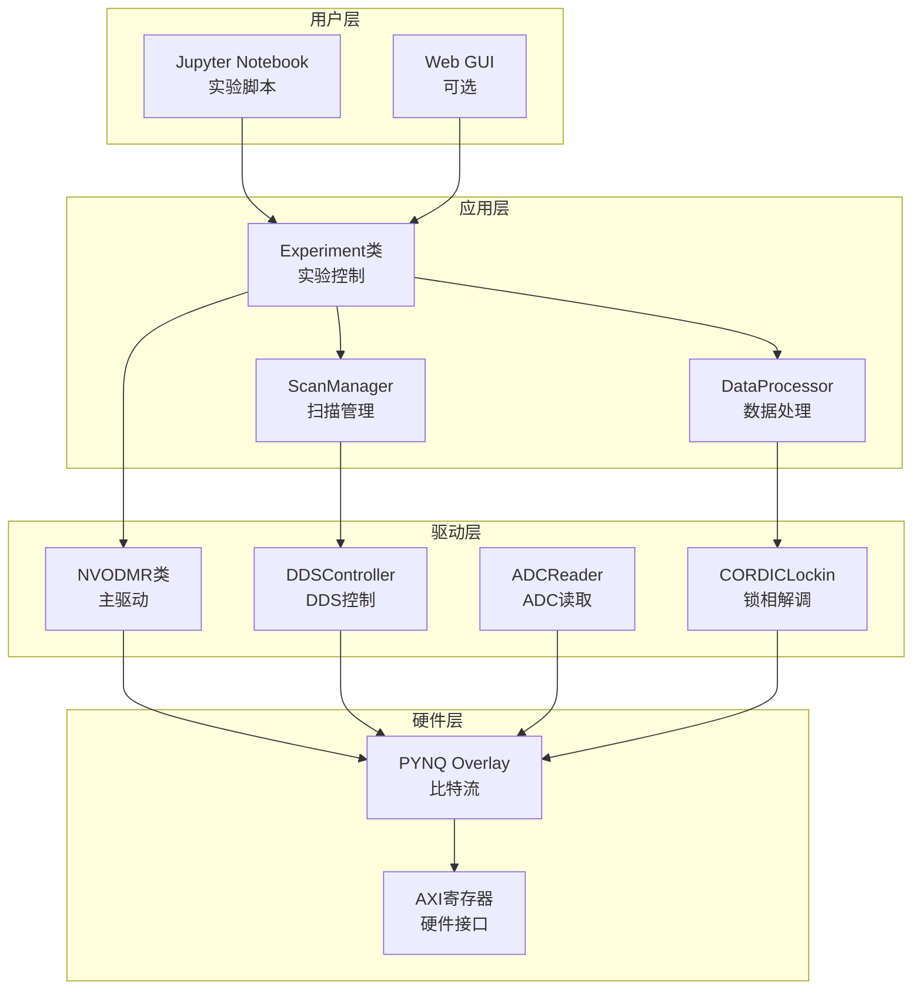

# NV色心实验系统 - 软件架构规划

> **文档版本**: V1.0
> **日期**: 2026-05-19
> **作者**: @S 软件工程师
> **评审人**: @A @V

---

## 一、软件架构概述

### 1.1 设计目标

构建基于PYNQ的Python控制框架，实现：
- 硬件寄存器访问与控制
- ODMR实验自动化
- 数据采集与实时处理
- 实验结果可视化
- 数据存储与导出

### 1.2 技术栈

| 层级 | 技术 | 说明 |
|------|------|------|
| 硬件接口 | PYNQ Overlay | FPGA比特流加载 |
| 驱动层 | Python类 | 硬件抽象接口 |
| 应用层 | Jupyter Notebook | 交互式实验控制 |
| 数据层 | HDF5 | 实验数据存储 |
| 可视化 | Matplotlib/Plotly | 实时绘图 |

---

## 二、软件架构图



---

## 三、核心类设计

### 3.1 NVODMR - 主驱动类

```python
class NVODMR:
    """NV色心ODMR系统主驱动类"""

    def __init__(self, bitstream_path: str):
        """初始化，加载比特流"""
        self.overlay = Overlay(bitstream_path)
        self.regs = self.overlay.nv_odmr.register_map

    def enable(self):
        """使能系统"""
        self.regs.CTRL = 0x01

    def disable(self):
        """禁用系统"""
        self.regs.CTRL = 0x00

    def get_status(self) -> dict:
        """获取系统状态"""
        status = self.regs.STATUS
        return {
            'ready': bool(status & 0x01),
            'dds_busy': bool(status & 0x02),
            'scan_busy': bool(status & 0x04),
            'data_valid': bool(status & 0x08)
        }
```

### 3.2 DDSController - DDS控制类

```python
class DDSController:
    """DDS信号发生器控制器"""

    def __init__(self, register_map):
        self.regs = register_map

    def set_frequency(self, freq_hz: float):
        """设置输出频率 (Hz)"""
        # 频率控制字 = freq * 2^32 / 100MHz
        freq_word = int(freq_hz * 2**32 / 100e6)
        self.regs.DDS_FREQ = freq_word

    def set_phase(self, phase_deg: float):
        """设置相位偏移 (度)"""
        # 相位控制字 = phase / 360 * 2^32
        phase_word = int(phase_deg / 360 * 2**32)
        self.regs.DDS_PHASE = phase_word

    def update(self):
        """触发频率更新"""
        # 写1触发更新
        pass  # 具体实现取决于硬件
```

### 3.3 ScanManager - 扫描管理类

```python
class ScanManager:
    """ODMR频率扫描管理器"""

    def __init__(self, register_map):
        self.regs = register_map

    def configure(self, start_freq: float, stop_freq: float,
                  step_freq: float, dwell_ms: float):
        """配置扫描参数"""
        self.regs.SCAN_START = self._freq_to_word(start_freq)
        self.regs.SCAN_STOP = self._freq_to_word(stop_freq)
        self.regs.SCAN_STEP = self._freq_to_word(step_freq)
        self.regs.SCAN_DWELL = int(dwell_ms * 100)  # 10us单位

    def start(self, mode: str = 'single'):
        """启动扫描"""
        ctrl = 0x01  # SCAN_EN
        if mode == 'continuous':
            ctrl |= 0x02
        ctrl |= 0x08  # TRIGGER
        self.regs.SCAN_CTRL = ctrl

    def stop(self):
        """停止扫描"""
        self.regs.SCAN_CTRL = 0x10  # ABORT

    def wait_complete(self, timeout: float = 60.0):
        """等待扫描完成"""
        import time
        start = time.time()
        while time.time() - start < timeout:
            if not (self.regs.STATUS & 0x04):  # SCAN_BUSY
                return True
            time.sleep(0.001)
        return False

    def _freq_to_word(self, freq_hz: float) -> int:
        """频率转换为控制字"""
        return int(freq_hz * 2**32 / 100e6)
```

### 3.4 DataProcessor - 数据处理类

```python
class DataProcessor:
    """ODMR数据处理"""

    def __init__(self, register_map):
        self.regs = register_map

    def read_amplitude(self) -> float:
        """读取解调幅值"""
        raw = self.regs.DATA_AMPLITUDE
        # 转换为实际幅值（根据CORDIC输出格式）
        return raw * 1.0  # 需要校准

    def read_phase(self) -> float:
        """读取解调相位"""
        raw = self.regs.DATA_PHASE
        # 转换为度数
        return raw * 360.0 / 2**16

    def configure_cordic(self, iterations: int = 16):
        """配置CORDIC参数"""
        self.regs.CORDIC_CTRL = iterations

    def configure_iir(self, coeff_a: list, coeff_b: list):
        """配置IIR滤波器系数"""
        # Q14定点数格式
        self.regs.IIR_COEFF_A = (coeff_a[1] << 16) | coeff_a[0]
        self.regs.IIR_COEFF_B = (coeff_b[1] << 16) | coeff_b[0]
```

### 3.5 Experiment - 实验控制类

```python
class Experiment:
    """ODMR实验主控类"""

    def __init__(self, bitstream_path: str = 'nv_odmr.bit'):
        self.nv = NVODMR(bitstream_path)
        self.dds = DDSController(self.nv.regs)
        self.scan = ScanManager(self.nv.regs)
        self.data = DataProcessor(self.nv.regs)

    def run_odmr_scan(self, start_freq: float, stop_freq: float,
                      step_freq: float, dwell_ms: float = 10.0) -> dict:
        """执行ODMR扫描实验"""
        # 使能系统
        self.nv.enable()

        # 配置扫描
        self.scan.configure(start_freq, stop_freq, step_freq, dwell_ms)

        # 启动扫描
        self.scan.start()

        # 采集数据
        frequencies = []
        amplitudes = []
        phases = []

        current_freq = start_freq
        while current_freq <= stop_freq:
            if self.nv.get_status()['data_valid']:
                frequencies.append(current_freq)
                amplitudes.append(self.data.read_amplitude())
                phases.append(self.data.read_phase())
                current_freq += step_freq

        # 等待完成
        self.scan.wait_complete()

        return {
            'frequency': frequencies,
            'amplitude': amplitudes,
            'phase': phases
        }

    def save_data(self, data: dict, filename: str):
        """保存实验数据到HDF5"""
        import h5py
        with h5py.File(filename, 'w') as f:
            f.create_dataset('frequency', data=data['frequency'])
            f.create_dataset('amplitude', data=data['amplitude'])
            f.create_dataset('phase', data=data['phase'])
```

---

## 四、Jupyter Notebook示例

### 4.1 基础实验脚本

```python
# NV色心ODMR实验 - 基础扫描
from nv_odmr import Experiment
import matplotlib.pyplot as plt

# 初始化实验
exp = Experiment('nv_odmr.bit')

# 配置参数
START_FREQ = 2.68e9  # 2.68 GHz
STOP_FREQ = 3.06e9   # 3.06 GHz
STEP_FREQ = 1e6      # 1 MHz步进
DWELL_MS = 10        # 10 ms驻留

# 执行扫描
print("开始ODMR扫描...")
result = exp.run_odmr_scan(START_FREQ, STOP_FREQ, STEP_FREQ, DWELL_MS)

# 绘制结果
plt.figure(figsize=(10, 6))
plt.plot(result['frequency'], result['amplitude'])
plt.xlabel('Frequency (Hz)')
plt.ylabel('Amplitude (a.u.)')
plt.title('NV Center ODMR Spectrum')
plt.grid(True)
plt.show()

# 保存数据
exp.save_data(result, 'odmr_scan_001.h5')
print("实验完成，数据已保存")
```

### 4.2 高级功能示例

```python
# 连续扫描与实时绘图
from nv_odmr import Experiment
import matplotlib.pyplot as plt
from IPython.display import clear_output
import time

exp = Experiment('nv_odmr.bit')

# 配置连续扫描
exp.scan.configure(2.7e9, 3.0e9, 0.5e6, 5.0)
exp.scan.start(mode='continuous')

# 实时绘图
plt.ion()
fig, ax = plt.subplots()

for i in range(100):  # 100次扫描
    data = exp.run_odmr_scan(2.7e9, 3.0e9, 0.5e6, 5.0)

    ax.clear()
    ax.plot(data['frequency'], data['amplitude'])
    ax.set_xlabel('Frequency (Hz)')
    ax.set_ylabel('Amplitude')
    ax.set_title(f'Scan #{i+1}')
    plt.pause(0.1)

exp.scan.stop()
```

---

## 五、文件结构

```
03_code/02_software/
├── nv_odmr/
│   ├── __init__.py
│   ├── nv_odmr.py      # 主驱动类
│   ├── dds.py          # DDS控制器
│   ├── scan.py         # 扫描管理
│   ├── data.py         # 数据处理
│   └── utils.py        # 工具函数
├── notebooks/
│   ├── 01_basic_scan.ipynb
│   ├── 02_advanced_odmr.ipynb
│   └── 03_data_analysis.ipynb
├── tests/
│   └── test_nv_odmr.py
└── setup.py
```

---

## 六、版本历史

| 版本 | 日期 | 变更内容 | 作者 |
|------|------|----------|------|
| V1.0 | 2026-05-19 | 初始版本 | @S |

---

**下一步: 物理参数对齐表 (@Q)**
