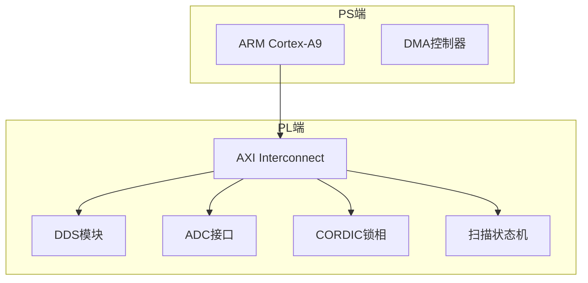

# P0_07 架构文档强制评审

> **规则优先级**：P0（最高优先级）  
> **生效日期**：2026-05-19  
> **制定人**：@C老板  
> **执行人**：@A 架构师 / @V 工程规则管理师 / @P 项目经理  
> **适用范围**：所有硬件/软件模块开发

---

## 一、规则目的

确保"文档先行"原则得到执行，任何代码编写前必须有对应的架构设计文档，避免无设计编码导致的系统性问题。

---

## 二、规则内容

### 2.1 文档先行原则（强制）

```
任何代码编写前，必须有对应的架构文档
├── 有文档 → 允许编码
└── 无文档 → 禁止编码，先写文档
```

### 2.2 强制文档清单

| 开发内容 | 必须文档 | 责任人 | 评审人 |
|----------|----------|--------|--------|
| 系统架构 | 系统架构图（Mermaid） | @A | @V @P |
| 模块设计 | 模块接口定义 | @A | @V @P |
| 引脚分配 | 引脚规划文档 | @H | @A @V |
| 时序约束 | 时序预算分析 | @H | @A @V |
| 时钟设计 | 时钟树架构 | @A @H | @V @P |
| 复位设计 | 复位策略文档 | @A @H | @V @P |
| AXI接口 | AXI寄存器映射 | @S @A | @V @P |
| 软件架构 | 软件架构图 | @S | @A @V |

### 2.3 三方评审机制（强制）

所有架构文档必须经过@A @V @P三方评审：

```
文档编写 → @A审核 → @V合规检查 → @P项目管理审核 → 通过
    ↑___________________________________________|
                    （不通过返回修改）
```

### 2.4 文档版本控制（强制）

- 所有文档纳入Git版本控制
- 文档变更必须记录变更日志
- 代码必须与文档版本匹配

---

## 三、文档标准

### 3.1 系统架构图（Mermaid）

```markdown
## 系统架构图



### 3.2 模块接口定义

```markdown
## 模块：dds_generator

### 端口定义

| 信号名 | 方向 | 位宽 | 说明 |
|--------|------|------|------|
| clk | input | 1 | 100MHz时钟 |
| rst_n | input | 1 | 异步复位，低有效 |
| freq_word | input | 32 | 频率控制字 |
| phase_out | output | 14 | DDS输出数据 |
| valid | output | 1 | 数据有效指示 |

### 时序要求

- 建立时间：≥2ns
- 保持时间：≥1ns
- 输出延迟：≤5ns
```

### 3.3 引脚规划文档

```markdown
## 引脚分配规划

### Bank 34（高速信号）

| 信号名 | 引脚 | I/O标准 | 驱动 | 备注 |
|--------|------|---------|------|------|
| sys_clk_50m | U18 | LVCMOS33 | - | MRCC |
| dds_clk_out | T16 | LVCMOS33 | 12mA | Fast |
| dds_data_out[0] | R17 | LVCMOS33 | 12mA | Fast |
| ... | ... | ... | ... | ... |

### 验证状态

- [x] 所有引脚已查官方Pinout文档
- [x] 无VCCO/GND引脚误用
- [x] 时钟引脚使用MRCC/SRCC
- [x] 高速信号使用HR Bank
```

### 3.4 时序预算分析

```markdown
## 时序预算分析

### 时钟定义

| 时钟名 | 频率 | 周期 | 来源 |
|--------|------|------|------|
| sys_clk | 100MHz | 10ns | 板载晶振 |
| axi_clk | 100MHz | 10ns | PS FCLK |
| adc_clk | 10MHz | 100ns | 外部ADC |

### 时序路径分析

| 路径 | 延迟预算 | 实际延迟 | 裕量 | 状态 |
|------|----------|----------|------|------|
| CLK→DDS输出 | 8ns | 5ns | 3ns | ✅ |
| AXI→寄存器 | 8ns | 4ns | 4ns | ✅ |
| ADC→采样 | 90ns | 20ns | 70ns | ✅ |

### 目标

- WNS（Worst Negative Slack）：> 1ns
- TNS（Total Negative Slack）：= 0
```

### 3.5 AXI寄存器映射

```markdown
## AXI寄存器映射

### 寄存器列表

| 地址偏移 | 名称 | 类型 | 位宽 | 说明 |
|----------|------|------|------|------|
| 0x00 | CTRL | R/W | 32 | 全局控制寄存器 |
| 0x04 | DDS_FREQ | R/W | 32 | DDS频率控制字 |
| 0x08 | SCAN_START | R/W | 32 | 扫描起始频率 |
| 0x0C | SCAN_STOP | R/W | 32 | 扫描终止频率 |
| 0x10 | SCAN_STEP | R/W | 32 | 扫描步进 |
| 0x14 | STATUS | RO | 32 | 状态寄存器 |

### 位域定义

#### CTRL (0x00)

| 位 | 名称 | 说明 |
|----|------|------|
| 0 | EN | 全局使能 |
| 1 | DDS_EN | DDS使能 |
| 2 | SCAN_EN | 扫描使能 |
| 3 | ADC_EN | ADC使能 |
| 31:4 | Reserved | 保留 |
```

---

## 四、检查清单

### 4.1 通用检查清单

- [ ] 文档使用Markdown格式
- [ ] 文档包含版本号和日期
- [ ] 文档包含作者和评审人
- [ ] 图表使用Mermaid或ASCII
- [ ] 所有参数有单位
- [ ] 所有约束有依据

### 4.2 架构文档检查清单

- [ ] 系统架构图（Mermaid）
- [ ] 模块划分清晰
- [ ] 数据流明确
- [ ] 控制流明确
- [ ] 接口定义完整

### 4.3 引脚规划检查清单

- [ ] 引脚分配表
- [ ] 官方Pinout验证
- [ ] I/O标准定义
- [ ] 驱动能力定义
- [ ] 时钟引脚验证

### 4.4 时序约束检查清单

- [ ] 时钟定义
- [ ] 输入延迟约束
- [ ] 输出延迟约束
- [ ] 虚假路径设置
- [ ] 时序预算分析

---

## 五、违规处理

| 违规情况 | 处理措施 |
|----------|----------|
| 无文档即编码 | 代码作废，要求补文档 |
| 文档未评审 | 暂停开发，完成评审 |
| 文档与代码不符 | 要求同步更新 |
| 文档质量不达标 | 退回修改 |

---

## 六、工具支持

### 6.1 文档模板

位置：`05_rules/templates/`

- `architecture_template.md` - 架构文档模板
- `pinout_template.md` - 引脚规划模板
- `timing_template.md` - 时序分析模板
- `axi_reg_template.md` - AXI寄存器模板

### 6.2 自动化检查

```python
# 文档检查脚本
def check_documentation():
    checks = [
        check_architecture_doc(),
        check_pinout_doc(),
        check_timing_doc(),
        check_axi_reg_doc()
    ]
    return all(checks)
```

---

## 七、版本历史

| 版本 | 日期 | 变更内容 | 作者 |
|------|------|----------|------|
| V1.0 | 2026-05-19 | 初始版本 | @C |

---

**本规则为P0级，不可违背。**
